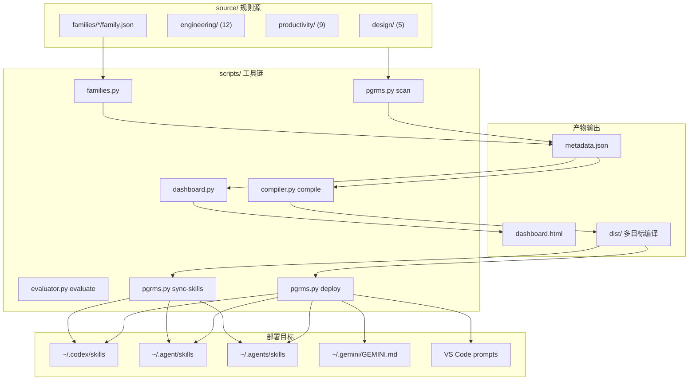
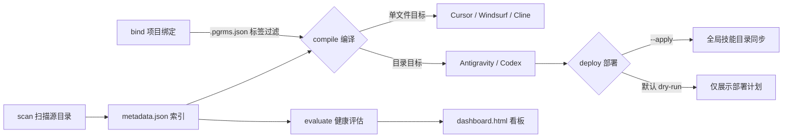
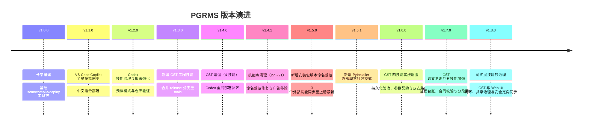

# PGRMS - 个人全局规则与技能管理系统

PGRMS 用于集中存储、校验、编译和部署可供 Codex、Cursor、Windsurf、Cline、Antigravity/Gemini 与 VS Code Copilot 调用的本地规则与技能。

这个仓库面向代码代理与本地自动化场景，重点做了几件事：

- 统一维护 `source/` 下的 26 条原创规则（design 5 / engineering 12 / productivity 9）
- 通过 `metadata.json` 与 `dashboard.html` 提供可检索、可视化的规则索引
- 支持面向不同 IDE/代理的多目标编译
- 支持项目级绑定与按标签筛选注入
- 支持全局部署，并区分 Antigravity/Gemini、VS Code Copilot 与 Codex 的落地目录

## 架构一眼清



## 逻辑一眼清



## 迭代一眼清



## 项目作用

- 扫描 `source/custom/` 与 `source/registry/`，重建规则索引 `metadata.json`
- 编译生成适用于 Cursor、Windsurf、Cline、Antigravity/Gemini 与 Codex 的目标产物
- 通过 `.pgrms.json` 绑定项目技术栈，仅向目标项目注入匹配标签的规则
- 生成仓库看板 `dashboard.html`
- 内置面向 CST 的工程技能，覆盖论文证据到模型交付、Python 控制、History VBA 建模、参数化建模与复杂几何原生操作
- 使用 `source/families/` 管理技能族职责、依赖与知识归属，不改变单个 Skill 的触发或部署边界

## 推荐的 Codex 工作流

```powershell
python scripts/pgrms.py scan
python scripts/pgrms.py compile --target codex
python scripts/pgrms.py family validate --all
python -m pytest -q
python scripts/validate_repository.py
```

默认情况下，`compile --target codex` 会把 Codex 技能输出到 `dist/codex/skills`。如果使用 `--path` 绑定某个项目，则会输出到该项目的 `.codex/skills` 目录。

Codex 编译默认只纳入 `audience: codex-core` 或 `audience: codex-project` 的规则；`archive` 规则不会进入默认 Codex 技能包。

显式使用 `--family cst` 时会按 Manifest 顺序完整编译 CST 技能族，不再使用项目 tags 拆分成员。

## 技能族与定向同步

技能族是非部署型管理层。可部署 Skill 仍保持在原有平级目录中；`source/families/<family-id>/family.json` 只描述成员、职责、依赖、知识归属和治理入口。

技能族至少需要两个形成闭环的成员；不要为了满足成员数而加入无关 Skill。成员只能有一个主技能族，但多个族可以通过 `governance.shared_retrospective: true` 复用一个**不属于任何成员列表**的共享治理 Skill。显式面向 Codex 编译或同步时，所有成员都必须是 `codex-core` 或 `codex-project`；否则命令会失败，避免 archive 成员被静默遗漏。

当前已启用两个技能族：

- `cst`：CST 建模与交付闭环，使用专属的 `cst-skills-retrospective` 治理。
- `web-ui-delivery`：`ui-ux-pro-max` → `frontend-design` → `webapp-testing`，使用共享的 `skill-family-governance` 治理。

文档类 skills 仍处于候选阶段：在明确 Codex 受众、跨格式交接和每个成员的 evals 之前，不建立 `document-artifacts` 清单，也不改变 archive 部署策略。

```powershell
python scripts/pgrms.py family list
python scripts/pgrms.py family show cst
python scripts/pgrms.py family validate cst
python scripts/pgrms.py compile --target codex --family cst
python scripts/pgrms.py sync-skills --family cst
python scripts/pgrms.py sync-skills --family cst --apply
```

`sync-skills` 默认 dry-run，只同步技能包到 `~/.agent/skills`、`~/.agents/skills` 和 `~/.codex/skills`。它不会修改 Git、Gemini 或 VS Code 全局配置；真实同步会备份同名 Skill，并用 SHA-256 校验部署结果。

## 全局部署

预演模式不会写入用户环境，只会扫描、编译并展示部署计划：

```powershell
python scripts/pgrms.py deploy
```

执行真实全局部署：

```powershell
python scripts/pgrms.py deploy --apply
```

部署完成后，会把产物同步到以下位置：

- `~/.agent/skills`
- `~/.agents/skills`
- `~/.codex/skills`
- `~/.gemini/GEMINI.md`
- `~/.gitignore_global`
- VS Code Copilot 用户级 prompts 目录

如需在隔离环境中测试：

```powershell
python scripts/pgrms.py deploy --apply --home .\temp_test_project\fake_home
```

封装脚本：

```powershell
.\deploy.ps1
.\deploy.ps1 -Apply
```

```bash
./deploy.sh
./deploy.sh --apply
```

真实部署会在目标 HOME 下生成 `.pgrms-deploy-logs` 日志目录，并在覆盖已有技能前自动备份。

## 核心命令

```powershell
python scripts/pgrms.py scan
python scripts/pgrms.py list --sort score
python scripts/pgrms.py compile --target all
python scripts/pgrms.py compile --target codex
python scripts/pgrms.py family validate --all
python scripts/pgrms.py sync-skills --family cst
python scripts/pgrms.py bind --path <project> --tags python,git --ide codex --force
python scripts/pgrms.py deploy
python scripts/pgrms.py deploy --apply
```

## 仓库质量闸门

```powershell
python -m py_compile scripts\pgrms.py scripts\compiler.py scripts\families.py scripts\utils.py scripts\dashboard.py scripts\evaluator.py scripts\fetcher.py scripts\validate_repository.py
python -m pytest -q
python scripts\validate_repository.py
```

CI 会在推送和拉取请求中运行同等校验。

## 规则编写约定

每个 `RULE.md` 都应包含规范化 frontmatter，例如：

```markdown
---
name: example-skill
description: 用于触发该技能的简短说明
category: engineering
audience: codex-project
tags: [python, testing]
status: active
score: 10.0
---
```

约束建议如下：

- `name` 使用小写 `kebab-case`
- `category` 仅使用 `design`、`engineering`、`productivity`、`registry`
- `audience` 仅使用 `codex-core`、`codex-project`、`archive`
- `tags` 使用内联列表语法

## CST 技能

当前主分支已纳入以下 CST 工程技能：

- `cst-antenna-paper-reproduction`
- `cst-control-skill`
- `cst-history-macro-skill`
- `cst-parametric-modeling`
- `cst-advanced-geometry-operations`
- `cst-skills-retrospective`

前五个技能覆盖 CST 建模与交付，`cst-skills-retrospective` 负责有证据、需确认、源仓库优先的技能补强闭环：

- 从论文、专利、图纸或数据表建立四级证据台账，生成几何/参数合同，并交付可追溯的 CST 参数化复现模型
- CST Studio Suite 的精确工程连接、Python 控制、结果读取和关闭重开持久化验收
- History List / VBA 记录式建模、可重放参数初始化、动态拓扑与确定性命名
- 带参数契约、有效边界、普通 `Rebuild()` 优先策略、动态对象集合和多状态回归的 CST 参数化建模
- 原生 Bend、Transform、Boolean、WCS、双支路枢轴旋转、渐变间隙体与 loft ribbon 编排
- 复盘候选筛选、知识归属、修改前确认、验证、定向同步和手动 Git 归档交接

统一的 CST 操作闭环如下：


## 发布历史

### v1.8.0 - 2026-08-08

- 新增 `source/families/` 驱动的技能族管理：成员职责、依赖、有界知识归属和治理入口均由 Manifest 声明。
- 新增 `web-ui-delivery`：以 `ui-ux-pro-max`、`frontend-design` 与 `webapp-testing` 形成设计、实现和浏览器验收闭环。
- 新增共享 `skill-family-governance`，支持跨技能族的复盘候选筛选、确认闸门、验证与定向同步。
- 编译和同步显式技能族时校验 Codex audience，避免 archive 成员被静默遗漏；受管成员和共享治理者必须提供有效 evals。
- 强化 Family Harness、仓库校验和双平台 CI；验证 36 项测试通过。

### v1.7.0 - 2026-08-01

- 新增 `cst-antenna-paper-reproduction`：把论文、PDF、专利、图纸或数据表转换为可追溯、内部参数化的 CST 复现模型，采用四级证据台账、缺失数据决策门、几何/参数合同和分段构建回归
- 新增证据台账、几何合同、参数合同、验收报告模板及可执行合同校验脚本，明确已知、推导、假设和未实现边界
- 增强 `cst-control-skill`：加入 `--m` 显式启动、CST API 能力探测、API/Messages/模型树/前端四通道错误识别，以及缓存与分段持久化规则
- 增强 `cst-history-macro-skill`：修正可重放参数初始化方式，加入动态拓扑、确定性命名、分段 History 和 loft ribbon 构建规则
- 增强 `cst-parametric-modeling`：以普通 `Rebuild()` 作为默认回归，full History rebuild 降为隔离诊断，并将非法状态弹窗测试改为显式可选
- 增强 `cst-advanced-geometry-operations`：加入 loft ribbon、非退化端面、接触容差与尺寸证据等级规则，并补充专项参考
- 5 个 CST skill 结构校验、19 个评测场景格式与唯一性检查、合同模板正向测试均通过

### v1.6.0 - 2026-07-29

- 增强 `cst-control-skill`：移除安装盘符假设，增加目标工程精确匹配、保存持久化验收、原生保存回退、模型指纹保护和中文读回安全核验
- 增强 `cst-history-macro-skill`：区分参数创建与描述元数据修改，使用 `SetParameterDescription` 保持表达式、数值、顺序和依赖关系不变
- 增强 `cst-parametric-modeling`：加入参数契约、零变化/标称/大小值/非法状态回归矩阵、实际几何测量、动态对象集合和耦合结构联动规则
- 增强 `cst-advanced-geometry-operations`：加入双 Boom 绕馈电端内边缘对称外张、渐变间隙体、尾部负载和馈电接触的通用操作模式
- 新增 2 份 CST 持久化与复杂几何参考资料，并为 4 个技能各加入 3 条真实请求回归用例（共 12 条）

### v1.5.1 - 2026-07-26

- 新增 `pyinstaller-external-script-bundling` 技能：PyInstaller 打包外部解释器脚本的必备模式（CST/MATLAB worker 路径解析、`--add-data`、`_MEIPASS` 双模式兼容）

### v1.5.0 - 2026-07-26

- 新增 `installer-version-naming` 技能：离线安装包版本命名规范（程序名含版本号、六处一致、Inno Setup / NSIS 模板）
- 同步 `frontend-design` 至上游 v1.1.0（anthropics/claude-code）：全新两遍设计流程、反 AI 默认风格校准、UX 文案指导
- 同步 `matlab` 至上游 v1.1（K-Dense-AI, 2026-07-23）：安全边界、R2026a 钉定、7 步工作流、Python 互操作
- 同步 `ui-ux-pro-max` 至上游 v2.11.0（nextlevelbuilder）：84 styles / 192 palettes / 22 stacks、设计系统与表盘调节

### v1.4.1 - 2026-07-26

- 清理 6 个无效/低价值技能（brand-guidelines、internal-comms、web-artifacts-builder、skill-creator、antigravity、slack-gif-creator），技能库从 27 精简至 21
- 修复 `optimization_specialist` 目录命名为连字符规范（`code-iteration-optimization-specialist`）
- 移除 matlab 技能中嵌入的第三方商业广告
- README 新增三张 Mermaid 可视化图表（架构/逻辑/迭代）

### v1.4.0 - 2026-07-25

- 用增强版内容更新 `cst-control-skill`、`cst-history-macro-skill`、`cst-parametric-modeling`
- 新增 `cst-advanced-geometry-operations`，并纳入原生 Bend 参考资料
- 全局部署流程补齐 `~/.codex/skills` 同步路径

### v1.3.0 - 2026-07-25

- 新增 3 个 CST 工程技能
- 刷新规则索引与看板生成输出
- 将原 `release-v1.1.2` 分支合并回 `main`，后续统一在主分支维护

### v1.2.0 - 2026-06-23

- 强化 Codex 技能治理与部署行为
- 增加默认预演部署、项目本地 Codex 输出与仓库验证路径

### v1.1.2 - 2026-06-11

- 新增仓库级 GitHub 发布归档说明

## 分支策略

本仓库现已统一由 `main` 管理。后续发布、维护和规则更新均应直接落在 `main`，不再保留长期存在的发布分支。
