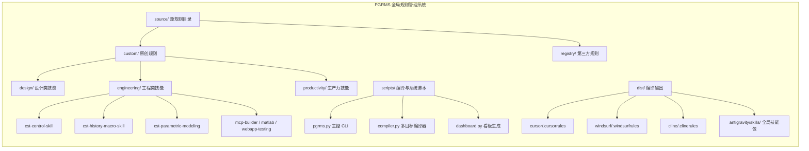
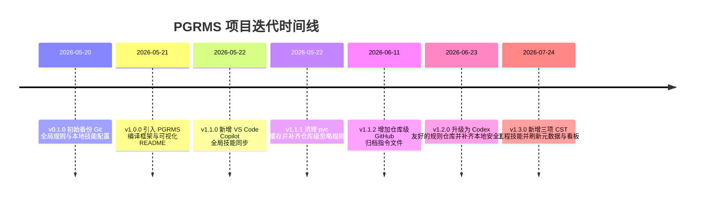

# PGRMS - Antigravity 全局规则与技能配置系统

本项目用于集中管理、编译、同步和归档可供 Antigravity、Cursor、Windsurf、Cline 与 VS Code Copilot 全局调用的规则（Rules）与技能（Skills）。当前仓库同时包含设计类、工程类、生产力类技能，以及一套可重复执行的扫描、编译、部署和归档流程。

---

## 一眼看清系统

### 1. 架构一眼看清
展示项目源目录、编译脚本、技能分类和编译产物之间的关系。



### 2. 逻辑一眼看清
展示从扫描规则到生成元数据、编译产物，再到部署全局技能的核心运行链路。

```mermaid
flowchart LR
    A["执行 deploy.ps1"] --> B["运行 pgrms.py scan"]
    B --> C["扫描 source/ 下 RULE.md"]
    C --> D["更新 metadata.json"]
    D --> E["刷新 dashboard.html"]
    E --> F["运行 pgrms.py compile --target all"]
    F --> G["生成 dist/ 多平台产物"]
    G --> H["同步 dist/antigravity/skills"]
    H --> I["写入 ~/.agent/skills 与 ~/.agents/skills"]
    I --> J["运行 sync-vscode"]
    J --> K["生成 VS Code 全局 instructions"]
```



### 3. 迭代一眼看清
展示版本节点和本次归档的演进脉络。



---

## 本次版本归档

### v1.3.0（2026-07-24）
- **[NEW]** 新增 `cst-control-skill`，用于 CST Studio Suite 2026 SP2 的 Python 连接、工程打开/创建、History 注入与结果读取。
- **[NEW]** 新增 `cst-history-macro-skill`，用于通过 History List 与 VBA 片段驱动可回放、可调试的 CST 建模流程。
- **[NEW]** 新增 `cst-parametric-modeling`，用于保留 CST 内部参数、支持 `Parameter Sweep`、`Optimizer` 与 `Tuning` 的参数化建模。
- **[OPS]** 重新扫描规则索引，更新 `metadata.json`，使新增技能可被编译链路和看板识别。
- **[DOC]** 刷新 `README.md` 的架构图、运行图和时间线，确保 GitHub 归档版本可一眼看清。

---

## 给 AI 助手的自动部署指令

当你在本仓库内执行全局配置部署时，优先使用下面的标准流程：

1. 一键部署：

```powershell
powershell -ExecutionPolicy Bypass -File .\deploy.ps1
```

2. 底层部署逻辑：
- 扫描 `source/` 下所有 `RULE.md`，重建 `metadata.json`
- 编译多平台规则产物到 `dist/`
- 将 `dist/antigravity/skills/` 同步到 `~/.agent/skills/`
- 将相同技能镜像同步到 `~/.agents/skills/`
- 生成并同步 VS Code Copilot 用户级全局 instructions
- 覆盖 `.gitignore_global` 与 `~/.gemini/GEMINI.md` 等全局配置文件

3. CST 相关技能：
- `cst-control-skill`
- `cst-history-macro-skill`
- `cst-parametric-modeling`

以上三项技能从 `v1.3.0` 起纳入仓库的正式归档版本。

---

## 历史版本

### v1.2.0（2026-06-23）
- **[OPS]** 将 PGRMS 升级为更安全的 Codex 友好型规则仓库
- **[NEW]** 增加默认 dry-run 部署、项目本地 Codex 编译输出与 `.codex/skills` 支持
- **[REF]** 补齐仓库级校验、部署日志、规则受众治理与本地验证路径

### v1.1.2（2026-06-11）
- **[DOC]** 新增仓库级 `.github/instructions/github-release-archiver.instructions.md`
- **[OPS]** 为 GitHub 归档流程补齐仓库内联指令入口

### v1.1.1（2026-05-22）
- **[REF]** 新增仓库根级 `.gitignore`，统一忽略 `__pycache__/`、`*.py[cod]` 与 `.pytest_cache/`
- **[REF]** 从 Git 索引中移除历史缓存产物，修复仓库污染问题

### v1.1.0（2026-05-22）
- **[NEW]** 新增 `~/.agents/skills` 镜像部署，覆盖 VS Code Copilot 全局技能同步
- **[NEW]** 新增 `sync-vscode` 指令，支持将中文输出约束同步为用户级 instructions

### v1.0.0（2026-05-21）
- **[NEW]** 引入 `skill-creator-cn`
- **[NEW]** 引入 `github-release-archiver`
- **[REF]** 完成 `source/custom/` 分类化重构
